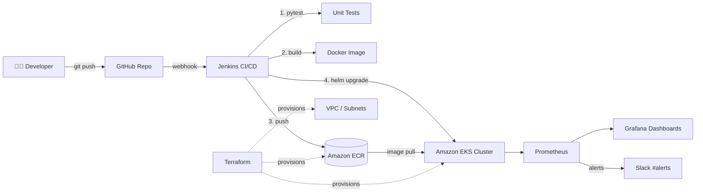

<div align="center">

# 🚀 NexusDeploy

**An end-to-end, production-style CI/CD platform built from scratch** — from a Flask microservice to a fully automated, monitored deployment on Kubernetes.

`Jenkins` → `Docker` → `Amazon ECR` → `Amazon EKS` → `Terraform` → `Prometheus & Grafana`

[](#-cicd-pipeline)
[](#-containerization)
[](#-kubernetes-deployment)
[](#-infrastructure-as-code)
[](#-infrastructure-as-code)
[](#-monitoring--observability)
[](#-monitoring--observability)

</div>

---

## 📖 Overview

**NexusDeploy** is a self-built DevOps portfolio project that simulates a real enterprise deployment pipeline. It takes a small Flask API from `git push` all the way to a live, auto-scaling, monitored service running on AWS EKS — with zero manual steps in between.

The goal wasn't just to "get it working" — it was to build each layer the way it's done in production: cached Docker layers, IAM roles instead of hardcoded keys, remote Terraform state with locking, Helm-templated manifests, and Slack-alerting on real cluster metrics.

> 💡 Every stage of this pipeline — test, build, push, deploy — is triggered automatically by a single `git push`, and a broken test blocks the deployment before it ever reaches the cluster.

---

## 🏗️ Architecture



**Flow:** A push to `main` triggers a GitHub webhook → Jenkins checks out the code, runs the unit test suite, builds a Docker image, pushes it to ECR, then deploys it to EKS via Helm — all in one automated run. Prometheus scrapes live cluster metrics, Grafana visualizes them, and Alertmanager pushes crash-loop / high-memory alerts straight to Slack.

---

## ✨ Features

- ✅ **Fully automated CI/CD** — push to `main` → tested → built → pushed → deployed, no manual steps
- ✅ **Fail-fast pipeline** — a failing unit test blocks the build before an image is ever created
- ✅ **Immutable, tagged images** — every deploy is tagged with its Git commit SHA for traceability and easy rollback
- ✅ **Infrastructure as Code** — the entire AWS footprint (VPC, EKS, ECR) is reproducible with `terraform apply`
- ✅ **Helm-templated Kubernetes manifests** — no manual `kubectl apply` in production paths
- ✅ **IAM-role based auth** — Jenkins and EKS nodes authenticate to AWS via instance roles, not static credentials
- ✅ **Live observability** — Prometheus + Grafana dashboards for CPU, memory, and pod health
- ✅ **Real-time alerting** — Slack notifications on crash loops and memory pressure
- ✅ **Cost-conscious design** — ECR lifecycle policies and a documented teardown process

---

## 🛠️ Tech Stack

| Layer | Tool | Purpose |
|---|---|---|
| **Application** | Python, Flask | Lightweight REST API (`/health`, `/api`) |
| **Testing** | Pytest | Unit test suite, gates the pipeline |
| **Containerization** | Docker | Reproducible, layer-cached image builds |
| **CI/CD** | Jenkins (Declarative Pipeline) | Test → build → push → deploy automation |
| **Image Registry** | Amazon ECR | Private, scanned Docker image storage |
| **Orchestration** | Amazon EKS, Helm | Deployment, scaling, service exposure |
| **Infrastructure as Code** | Terraform | VPC, EKS, ECR provisioned declaratively |
| **Monitoring** | Prometheus, Grafana, Alertmanager | Metrics, dashboards, Slack alerting |
| **Cloud Provider** | AWS (EC2, IAM, ECR, EKS, S3, DynamoDB) | Hosting and remote Terraform state |

---

## 📁 Project Structure

```
nexusdeploy/
├── app/
│   ├── app.py              # Flask application
│   ├── test_app.py         # Pytest unit tests
│   ├── requirements.txt    # Python dependencies
│   └── Dockerfile          # Multi-layer, cache-optimized image build
├── k8s/
│   ├── deployment.yaml     # Kubernetes Deployment spec
│   ├── service.yaml        # LoadBalancer Service spec
│   └── alerts.yaml         # PrometheusRule alerting definitions
├── nexusdeploy-chart/      # Helm chart (templated deployment/service)
│   ├── templates/
│   └── values.yaml
├── terraform/
│   ├── main.tf              # Provider config
│   ├── variables.tf         # Input variables
│   ├── vpc.tf                # VPC module (public/private subnets, NAT)
│   ├── eks.tf                 # EKS cluster + managed node group
│   ├── ecr.tf                  # ECR repository with image scanning
│   ├── outputs.tf              # Cluster endpoint, ECR URL outputs
│   └── backend.tf              # Remote state (S3 + DynamoDB locking)
├── Jenkinsfile              # Full pipeline: test → build → push → deploy
└── README.md
```

---

## ⚙️ CI/CD Pipeline

The `Jenkinsfile` defines a fully declarative pipeline with the following stages:

1. **Checkout** — pulls the latest commit from GitHub
2. **Install & Unit Test** — spins up a virtualenv, installs dependencies, runs the full `pytest` suite
3. **Docker Build & Tag** — builds the image, tagging it both `latest` and with the Git commit SHA
4. **ECR Login & Push** — authenticates via the EC2 instance's IAM role (no stored secrets) and pushes both tags
5. **Deploy to EKS** — runs `helm upgrade --install` against the cluster, rolling out the new commit-tagged image
6. **Terraform Plan** *(manual-approval gate)* — infrastructure changes are always planned, never auto-applied

A GitHub webhook triggers the pipeline automatically on every push to `main`. A failed test stage halts the pipeline immediately — nothing is built or deployed on a broken commit.

---

## ☁️ Infrastructure as Code

The entire AWS footprint used to run the cluster manually in early testing was rebuilt as Terraform so it's **reproducible from a single command**:

- **VPC module** — public/private subnets across two AZs, single NAT gateway, tagged for EKS auto-discovery
- **EKS module** — managed node group (`t3.medium`, auto-scaling 2–4 nodes)
- **ECR resource** — private repository with vulnerability scan-on-push enabled
- **Remote state** — stored in S3 with DynamoDB-backed state locking to prevent concurrent applies

```bash
cd terraform
terraform init
terraform plan     # always reviewed before apply
terraform apply
```

Running `terraform plan` again after a successful apply returns `No changes.` — proving the configuration is fully idempotent.

---

## 📊 Monitoring & Observability

The `kube-prometheus-stack` Helm chart provides the full monitoring layer out of the box:

- **Prometheus** scrapes cluster and pod-level metrics
- **Grafana** dashboards visualize CPU, memory, and pod counts — including a custom **"NexusDeploy App Metrics"** dashboard scoped to this app's pods
- **Alertmanager** is wired to a Slack channel, firing on:
  - `PodCrashLooping` — restart rate > 0 over a 15-minute window
  - `HighMemoryUsage` — memory usage above 85% of the pod's limit

Under a `ab -n 1000 -c 50` load test, the Grafana dashboards show real-time CPU and request-rate spikes as the deployment scales.

---

## 🚦 Getting Started

### Prerequisites

`aws-cli` · `docker` · `kubectl` · `helm` · `terraform` · `git` · an AWS account with billing alerts enabled

### Run the app locally

```bash
git clone https://github.com/tarunre12/NexusDeploy.git
cd NexusDeploy/app
python3 -m venv venv && source venv/bin/activate
pip install -r requirements.txt
python app.py

# in another terminal
curl http://localhost:3000/health
```

### Run the full test suite

```bash
pytest -v
```

### Build and run the container

```bash
docker build -t nexusdeploy-app .
docker run -p 3000:3000 nexusdeploy-app
```

> ⚠️ Spinning up the full pipeline (Jenkins on EC2 + EKS cluster) incurs AWS charges — the EKS control plane alone runs ~$0.10/hour. Remember to `terraform destroy` and stop/terminate the Jenkins instance when you're done experimenting.

---

## 🧠 What I Learned

Building this end-to-end — rather than following a single "deploy to Kubernetes" tutorial — meant dealing with the parts that usually get skipped:

- Structuring IAM roles so **no service ever holds a static AWS key**
- Ordering Dockerfile layers so CI builds stay fast as dependencies grow
- Wiring a **fail-fast pipeline** so bad code never reaches the cluster
- Making infrastructure changes **reviewable and reversible** with `terraform plan` and a manual apply gate
- Turning raw Prometheus metrics into **actionable Slack alerts**, not just dashboards nobody looks at

---

## 🔭 Future Improvements

- [ ] Add a staging environment with a manual promotion gate to production
- [ ] Migrate Jenkins credentials fully to AWS Secrets Manager
- [ ] Add Horizontal Pod Autoscaler (HPA) based on custom Prometheus metrics
- [ ] Introduce blue/green or canary deployments via Argo Rollouts
- [ ] Add GitHub Actions as an alternative pipeline for comparison

---

## 👤 Author

**Tarun Reddy**
🔗 [github.com/tarunre12](https://github.com/tarunre12)

---

<div align="center">
<sub>Built as a hands-on DevOps portfolio project — every component was configured, tested, and torn down manually to understand exactly what it does.</sub>
</div>
